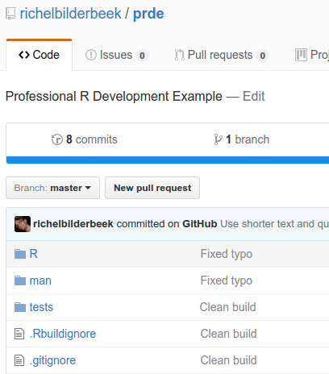
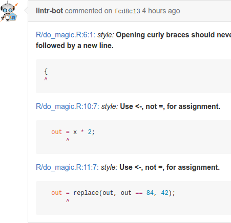

# Raising your code to professional standards

[](https://travis-ci.org/richelbilderbeek/sdj_raising_your_code_to_professional_standards)

My article published in the SDJ about raising 
your code to professional standards.

# Raising your code to professional standards.

## Introduction

You want to be good. You want to learn to write a package that
follows all of the expert guidelines. You are open to being corrected
by any professional tool and learn from it. You want to
program like the pros. You want to create a package you are proud of.

Then you should read this article.

## What you will learn‭

You'll learn to add automatic testing for
coding standard and code coverage and good practices. 
This is all triggered by a *git push*; by uploading 
your package's new code to its GitHub. 

We'll use an example package as a testcase. 

In the end, you'll have a script that forces you to work like a pro.

## What you should know‭

It is assumed you know how to
 
 * read a function with basic R code
 * create a package 
 * use the 'testthat' testing framework's most basic functionality
 * let that package be hosted on GitHub

To be able to read an R function, read any beginner book about
R or use the 'swirl' package. The other points are covered 
in [Hadley, 2015], a book that I recommend beginners to read as soon as possible.

## About the author

I enjoy to teach programming following the industry's highest standards. 
My students, aged 7-77 years, are all confronted with quotes from the literature,
especially from 'The Pragmatic Programmer' by Andrew Hunt and David Thomas.
Regarding R, I like to quote all works from Hadley Wickham.

## Advantages‭ 

Following the experts' good practices will save you time developing your code.

The setup of this article helps you follow some of these good practices,
which are a rational coding standard, having a high code coverage and 
using R in the preferable way.

## Use in practice

In this article, I will show how to let yourself be helped.

First, I will introduce the package 'prde' ('Professional R Development Example'). 
This package serves as a testcase and is hosted on GitHub. The package is flawed on purpose, 
yet passes all CRAN tests. 

Then I show how to set up accounts for two websites, that will play
smoothly with your GitHub account. These are Travis CI, for setting
up automatic testing (more on that later), and Codecov, that tracks
your package code's coverage (more on that later).

Having all websites activated, a file is uploaded to your 
package's GitHub, that will trigger responses by the Travis CI and Codecov website.
I'll discuss these responses one by one.

### Testcase

You have created a package called 'prde', that follows the
structure described in [Wickham, 2015]. The package is
hosted on GitHub:



Within the 'prde' package resides a brilliant function, called *do_magic*,
like this:

```
#' Multiples all values by two, 
#'   except 42, which stays 42
#' @param x input, must be numeric
#' @return magicified output
#' @export
do_magic <- function(x)
{
  if (!is.numeric(x)) {
    stop("x must be numeric");
  }
  out = x * 2;
  out = replace(out, out == 84, 42);
  out;
}
```

Listing 1. The 'do_magic' function

The function *do_magic* is stored in a file at a conventional location, 
which is *R/do_magic.R*.

You are proud of yourself: you've nicely documented the
function (using the 'roxygen2' package). Next to this,
your function checks its inputs, 
and fails fast if it cannot process these.

You even wrote some tests, using 'testthat', as shown below:

```
context("do_magic")

test_that("do_magic: use", {
  expect_equal(do_magic(42), 42)
  expect_equal(do_magic(1), 2)
})
```

Listing 2. The do_magic tests

This test is stored in a file at a conventional location, 
which is *tests/testthat/test-do_magic.R*.

You assume you did a great job, as no errors 
are found when you check the build in RStudio or using _devtools::check()_.
You can submit your package to CRAN tonight without any 
problem (except to convince that the package is relevant)!

### Intermezzo: what is continuous integration?

Continuous integration means that the effect of changed code, 
after pushing it to GitHub,
is shown automatically after a short amount of time. In other words:
if you broke it, you'll notice early. Or, if someone else breaks it, the team
will notice early. Also, when someone submits a Pull Request,
you will see if it will break the build already before accepting it.

There are many other continuous 
integration services that work just as well, like Jenkins, Codeship, CircleCI and Wercker.
I just happened to learn Travis CI first and I am unaware of the quality of the other
continuous integration services. 

### Activate Travis CI


The first step of our setup is to activate Travis CI. 

Travis CI is a continuous integration (hence, the 'CI' in the name) service, that 
is free to use when developing FLOSS software and works smoothly with GitHub.

We need to activate Travis CI first, because it is only when activated, 
that it will start running upon an upload to GitHub.

Go to the Travis CI website, _www.travis-ci.org_, and sign in with your GitHub account.
Travis requests authorization for some GitHub information, like your name and email.
After authorization, you see will see all your GitHub repositories 
and their activation status:


In this figure, you can see that I have at least three GitHub repositories,
of which one is not activated (the grey cross) and two are (the green check).

Go find the GitHub of your R package and activate it.

### Intermezzo: what is code coverage?

Code coverage is the percentage of lines of code covered by tests.
If a line is untested, either you have detected dead code (that can be removed)
or you should (be able to) write another test that does use that code.
Code coverage correlates with code quality [Del Frate et al., 1995].

There are other services that track code coverage, like Code Climate, Codacity, Coveralls, 
QuantifiedCode and many more. It just happens to be that the package we'll use ('lintr')
uses Codecov.

### Activate Codecov


The second step is to activate Codecov. 

Codecov is a website that shows your code coverage in a user-friendly form.
Codecov tracks a project's code coverage in time. If you develop over multiple
git branches, code coverage can be displayed for each branch seperately.

We need to activate Codecov now, because only when you have an account, 
Codecov will receive and display your code coverage.

Go to the Codecov website, *https://codecov.io*, and sign in with your GitHub account.
Codecov requests authorization for some GitHub information, like your name and email.

After authorization, you see all your GitHubs that have their code coverage measured before.
This screen will be mostly empty, as you have not measured any code coverage yet.
If you have multiple GitHub repositories that have their code coverage checked,
the Codecov screen will look like this:


In this figure, you can see that I have at least three GitHub repositories
that have their code coverage checked. 

### Add build script

The third step is to instruct Travis CI 
what to do when new code is uploaded to an activated GitHub.

Without a build script, Travis CI does not know what to do.
You can instruct Travis CI to do anything you can do on 
within the bash command language. A Travis CI build script is always named *.travis.yml*. 
The file name starts with a dot, which makes it a hidden file on UNIX systems.
The '.yml' extension is an abbreviation of 'Yet another Markup Language'.

In your project's root folder, create a file named *.travis.yml*, and put the following text in it:

```
language: r
cache: packages

r_github_packages:
  - jimhester/lintr
  - jimhester/covr
  - MangoTheCat/goodpractice

after_success:
  - Rscript -e "lintr::lint_package()"
  - Rscript -e "covr::codecov()"
  - Rscript -e "goodpractice::gp()"
```

Listing 3. The Travis CI script

You can see that this *.travis.yml* is straightforward.
The first line states that the programming language used here is R (Travis CI supports
many other languages as well).
The second line tells Travis CI to keep the installed packages in a cache, 
to prevent needless reinstalls of these packages.
The 'r_github_packages' section instructs Travis CI to install these GitHub-hosted packages.
The 'after_success' section is run after the package passes a _devtools::check()_. 
In this section, it will run checks
from the 'lintr', 'covr' and 'goodpractice' packages. More on those packages later.

After having created this *.travis.yml* file, commit and push it to GitHub.
I enjoy naming this commit 'Go Travis'.

After pushing *.travis.yml* to your GitHub, it will be visible immediatly on GitHub:


This push to your GitHub triggers Travis CI and it will start doing its work immediatly.

### Read results

Travis CI needs some time to set up a virtual machine. Every time you push to GitHub, a
virtual machine is created, so you have a (nearly) clean slate that your tests run in.

To see Travis CI do its work, go back to the Travis CI website, *https://travis-ci.org*. 
After approximately one minute, you'll see Travis CI's progress.
You will see it first installs all packages and their dependencies.
The *.travis.yml* script caches all packages, making the second build faster.

Here is the header of your first build:


In this build log, in line 112, Craig Citro, Hadley Wickham and Jim Hester are 
all mentioned for their contributions to make R packages easy to be checked by Travis.


We already know your build will pass this check, as you've already checked the build 
in RStudio or used _devtools::check()_.
Would the build not pass, you would see the same output as given by _devtools::check()_ and nothing more.
If the build passes, there will be some new information at the bottom:


Clicking on the triangles on the left reveals some extra information.

First, we'll expand the feedback from the 'lintr' package (by Jim Hester). It shows:


'lintr' is a package to check if your coding style follows the one used by, among others,
Wickham (2014) and Wickham (2015). You'll see that 'lintr' has some suggestions. 


Not only on the Travis CI website can you this information.
Also my good friend lintr-bot will comment on your commit on GitHub, with exactly the same messages:
 
 

lintr-bot is always right. In case you disagree with it, you can modify the 
checks done by 'lintr' and allow for other coding standards.


Moving on from lintr-bots words of wisdom,
we'll expand the feedback from the 'goodpractice' package (by MangoTheCat). This one shows:


'goodpractice' extends 'lintr' by adding good practices. For example, it may
suggest not to use a partical function, but use a better alternative instead. 

There is a third triangle that can be extended, about the call to the 'covr' package, 
in the Travis build log. 
Feel free to take a look there, but it won't be too helpful.
Instead, go back to the Codecov website, https://codecov.io, 
to get your code coverage displayed in a prettier way:


For your code coverage, you can see that you have forgotten to test if your function indeed
throws an exception when the input is not numerical.

You can thank the tools (and people having written those) for helping 
you become a better R programmer. 

You may listen to these advices and fix these. 
If you disagree on the experts' advice, I ask you to ponder 
why the experts have picked those standards, 
as those same experts are also aware of your arguments 
favoring other standards.

For my students, I enforce a clean 'oclint' and 'goodpractice' log and a code coverage of at least 95%.
It is open to discussion what should be the minimal code coverage limit.
Personally, I favor a 100% code coverage. 
The argumentation for an imperfect code coverage is, 
that if you cannot test for something, 
you probably should not keep those rarely triggered if-statements in.
For my students, I allow them some leeway and test for 
exotic (and sometimes imaginary) things like
file corruption and data races. 
They will have an incomplete code
coverage for a fun reason.

## Who can use it?

Already from the beginner level, one can use these techniques.
For FLOSS development, all tools are free.
For closed-source development, there is a fee on using GitHub, Travis CI and Codecov.

## What if I use it?

```
Code better. Sleep better. [Langr, 2013]
```

 * You can rest assured you've followed all best practices
 * A potential collaborator can read your code more easily
 * There will be no need to write a low-level coding standard
 * Someone that submits a Pull Requests will be checked for these same high standards

## What else you can do‭ 

When having all tests cleared and high code coverage, you may want to show the world.

This can be done by adding build badges to your *README.md*, in your GitHub's main folder. 
Such badges look like this:


To display these badges, add the following code to the *README.md* in your GitHub's main folder:

```
[](https://travis-ci.org/[yourname]/[package name])
[](https://codecov.io/github/[yourname]/[package name]?branch=master)
```
I hope it will inspire other people to do the same. It did so for me.

## Summary

In this article, you have learned how to let
yourself be corrected when deviating from
the experts' good practice.

We've created and activiated two website accounts and written
one text file. The time it took us setting up these tools will be won back
quicky from the future changes to our R package.

## Acknowledgements

I'd like to thank Luis Boullosa, Rampal S. Etienne and Cyrus A. Mallon for thir feedback on a draft of this article.

## On the Web

  * https://github.com/richelbilderbeek/sdj_prde: the text and pictures used in this article
  * https://github.com/richelbilderbeek/prde: the GitHub developed in this article
  * https://github.com/richelbilderbeek/PresentationsAboutR: slides and videos of my presentations about R
  * https://travis-ci.org: the Travis CI website
  * https://codecov.io: the Codecov website

## Glossary

 * Code coverage: the percentage of statements executed in your tests
 * Continuous integration: integrate development branches continuously, monitoring their effects continously
 * FLOSS: Free/Libre and Open-Source Software: software that is free (as in speech) and open-source
 * git: version control system
 * `git push`: the git command to upload modified code to a git repository host
 * git repository: code that is uses git for version control
 * git repository host: website for a git repository
 * IDE: Integrated Development Environment, a program that helps to develop code
 * GitHub: a git repository host
 * RStudio: R IDE
 * Travis CI: online continuous integration service

## References

 * [Del Frate et al., 1995] Del Frate, Fabio, et al. "On the correlation between code coverage and software reliability." Software Reliability Engineering, 1995. Proceedings., Sixth International Symposium on. IEEE, 1995.
 * [Hunt & Thomas, 2000] Hunt, Andrew, and David Thomas. The pragmatic programmer: from journeyman to master. Addison-Wesley Professional, 2000.
 * [Langr, 2013] Langr, Jeff. Modern C++ Programming with Test-driven Development: Code Better, Sleep Better. Pragmatic Bookshelf, 2013.
 * [Wickham, 2014] Wickham, Hadley. Advanced R. CRC Press, 2014.
 * [Wickham, 2015] Wickham, Hadley. R packages. " O'Reilly Media, Inc.", 2015.
