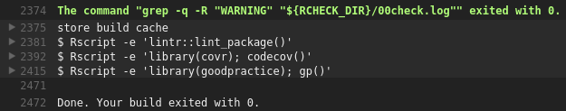

# Professional R development: being a good boy/girl

My article published in the SDJ about professional.

# Professional R development: being a good boy/girl

## Lead:‭ ‬An intro to the article‭ (‬1-5‭ ‬sentences‭)‬.

You want to be good. You want to (learn to) write code that
follows all good practices. You are open to being corrected
by any professional tool and learn from it. You want to
program like the pros. You should read this article.

## What you will learn‭...

In this article, you'll learn what continuous integration is. From
a default package, you'll add continuous integration. After this,
you'll add some trivial code that is checked for improvements
by extra tools. In the end, you'll have a script that forces you to work like a pro.

## What you should know‭...

It is assumed you know how to
 
 * read a trivial function with basic R code
 * create a package 
 * use the `testthat` testing framework most basic functionality
 * how to let that package be hosted on GitHub

To be able to read an R function, read any beginner book about
R or use the `swirl` package. The other points are covered 
in [Hadley, 2015], a book that recommend beginners to read as soon as possible.

## About the author

The author enjoys to teach programming following the industry's highest standards. 
His students, aged 7-77 years, are all confronted with quotes from the literature,
especially from 'The Pragmatic Programmer' by Andrew Hunt and David Thomas.
Within R, he like to quote all works from Hadley Wickham.

## Advantages‭ 

You are a novice R programmer. You have a brilliant idea. You
follow that avenue. All your packages will benefit!

A year later, you regret that descision. You could have known
you should not have done that, would you have read those books
and articles earlier. 

You can prevent this detour. When in Rome, do like the romans
do. Likewise, when programming in R, do like the experts do.

## Use in practice

### Testcase


You've written a brilliant function, called `do_magic`
like this:

```
#' Multiples all values by two, 
#'   except 42, which stays 42
#' @param x input, must be numeric
#' @return magicified output
#' @export
do_magic <- function(x)
{
  if (!is.numeric(x)) {
    stop("x must be numeric");
  }
  out = x * 2;
  out = replace(out, out == 84, 42);
  out;
}
```

You've nicely documentated it. 
You let it test its inputs.
You also wrote some tests:

```
context("do_magic")

test_that("do_magic: use", {
  expect_equal(do_magic(42), 42)
  expect_equal(do_magic(1), 2)
})
```

No errors are found when you check the build in RStudio or use `devtools::check()`.

You wonder if your code can be improved.
As a novice programmer, you may have no ideas.
Rest assured there will be packages that will have some suggestions.

### Activate Travis CI

First step is to activate Travis CI. Only when activated, Travis CI will start running upon a GitHub push.

Go to the Travis CI website, www.travis-ci.org, and sign in with your GitHub account.
Travis requests authorization for some GitHub information, like your name and email.
After authorization, you see all GitHubs and their activation status


The sliders indicate the Travis CI activation state. 
Go find your R package its GitHub and activate it.

### Activate Codecov

Second step is to activate Codecov. Only when you have an account, Codecov will receive and display your code coverage.

Go to the Codecov website, https://codecov.io, and sign in with your GitHub account.
Codecov requests authorization for some GitHub information, like your name and email.
After authorization, you see all the GitHubs that have sent their code coverages over.

### Add build script

Third step is to create a Travis CI build script.

In your project's root folder, create a file named `.travis.yml`.
The file starts with a dot, which makes it a hidden file.
The `yml` extension is an abbreviation of 'Yet another Markup Language'.

Get the following text in `.travis.yml`:

```
language: r
cache: packages

r_github_packages:
  - jimhester/lintr
  - jimhester/covr
  - MangoTheCat/goodpractice

after_success:
  - Rscript -e "lintr::lint_package()"
  - Rscript -e "covr::codecov()"
  - Rscript -e "goodpractice::gp()"
```

Then commit and push this new file to GitHub.
I like to name this commit `Go Travis!`.


### Read results

On `travis-ci.org`, after approximately one minute, you'll see Travis CI doing its work.
You will see Travis CI first installs all packages and their dependencies.
The `travis.yml` script caches all packages, making the second build finish faster.

Here is the header of your first build:


Craig Citro, Hadley Wickham and Jim Hester are all mentioned for their
contributions to make R packages easy to be checked by Travis.

We already know your build will pass, as you've already checked the build in RStudio or used `devtools::check()`.

The new information is at the bottom:



Clicking on the triangles on the left reveals some extra information.

First, we'll expand the `lintr` (a package by Jim Hester) feedback. It shows:

[The feedback given by lintr](TravisLintr.png)

`lintr` is a package to check if your coding style follow the one used by, among others,
[Wickham, 2014] and [Wickham, 2015]. You'll see that `lintr` has some suggestions. 

Then we'll expand the `goodpractice` (a package by MangoTheCat) feedback. This one shows:


`goodpractice` extends `lintr` by adding good practices. For example, it may
suggest not to use a function, but use a better alternative instead. 

The code coverage is not displayed here, but at the Codecov website. 
Go to the Codecov website, https://codecov.io, to see your code coverage:


You can see that you have forgotten to test if `do_magic` does
throw an exception when the input is not numerical.

You can thank the tools (and people having written those) for helping 
you become a better R programmer. You should listen to these advices
and fix these. 

For my students, I enforce a clean `oclint` and `goodpractice` log and a code coverage of at least 95%.

## Who can use it?

Already from the beginner level, one can use these techniques.
For FOSS development, all tools are free.
For closed-source development, there is a fee on using GitHub, Travis CI and Codecov.

## What if I use it?

```
Code better. Sleep better. [Langr, 2013]
```

 * As an developer, you can rest assured you've followed all best practices.
 * As a potential collaborator, it will be easier to read your code.
 * Within a team, there will be no need to write a low-level coding standard
 * As a package maintainer, let Pull Requests be checked for these same high standards

## What else you can do‭ 

When having all tests cleared and hig code coverage, you may want to show the world:

Add the following code to `README.md` to get the status badges displayed:

```
[](https://travis-ci.org/[yourname]/[package name])
[](https://codecov.io/github/[yourname]/[package name]?branch=master)
```

I hope it will inspire other people to do the same. I know that it did so for me.

## Summary

In this article, you have learned how to let
yourself be corrected when deviating from
the industry standard.

Go forth and develop like a pro.

## On the Web

  * https://github.com/richelbilderbeek/sdj_prde: the text and pictures used in this article
  * https://github.com/richelbilderbeek/prde: the GitHub developed in this article
  * https://github.com/richelbilderbeek/PresentationsAboutR: slides and videos of my presentations about R
  * https://codecov.io: the Codecov website

## Glossary

 * Continuous integration: integrate development branches continuously, monitoring their effects continously
 * git: version control system
 * GitHub: online git repository host
 * Travis CI: online continuous integration service

## References

 * [Hunt & Thomas, 2000] Hunt, Andrew, and David Thomas. The pragmatic programmer: from journeyman to master. Addison-Wesley Professional, 2000.
 * [Langr, 2013] Langr, Jeff. Modern C++ Programming with Test-driven Development: Code Better, Sleep Better. Pragmatic Bookshelf, 2013.
 * [Wickham, 2014] Wickham, Hadley. Advanced R. CRC Press, 2014.
 * [Wickham, 2015] Wickham, Hadley. R packages. " O'Reilly Media, Inc.", 2015.
