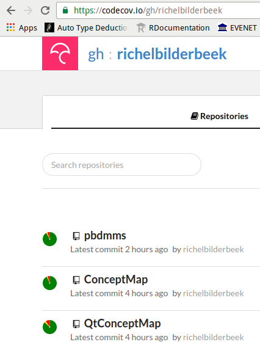

# Raising your code to professional standards.

## Introduction

You want to be good. You want to learn to write a package that
follows all of the expert guidelines. You are open to being corrected
by any professional tool and learn from it. You want to
program like the pros. You want to create a package you are proud of.

Then you should read this article.

## What you will learn‭

You'll learn to add automatic testing for
coding standard and code coverage and good practices. 
This is all triggered by a *git push* the command that uploads
your package's code to its GitHub. 

We'll use an example package as a test case. 

In the end, you'll have a script that forces you to work like a pro.

## What you should know‭

It is assumed you know how to
 
 * read a function with basic R code
 * create a package 
 * use the 'testthat' testing framework's most basic functionality
 * let that package be hosted on GitHub

In case you are not yet able to read an R function, I recommend 
reading [Matloff, 2011] or use the 'swirl' package. 

In case you are not able to write a package, use testthat or know GitHub, 
I recommend reading [Hadley, 2015].

## About the author

I enjoy to teach programming following the industry's highest standards. 
My students, aged 7-77 years, are all confronted with quotes of advice 
from the literature, especially from 'The Pragmatic Programmer' 
by Andrew Hunt and David Thomas. Regarding R, I like to quote all 
advice from Hadley Wickham.

## Advantages‭ 

Following the experts' good practices will save time in developing code.

The setup of this article follows some of these good practices.
The practices are a rational coding standard, have a high code coverage (all 
code is tested), and use R in a pragmatic way.

## In practice

In this article, I will show how to be helped by the experts.

First, I will introduce the package 'prde' ('Professional R Development Example'). 
This package serves as a test case for showing how its flaws are exposed by 
this article's setup. The package is thus flawed on purpose, 
yet passes all CRAN tests. 'prdr' is hosted on GitHub. 

Then I show how to set up accounts for two websites that will interact
seamlessly with a GitHub account. These are Travis CI, for setting
up automatic testing (more on that later), and Codecov that tracks
package code's coverage (more on that later).

Having all websites activated, a file is uploaded to the 
package's GitHub, which will trigger responses by the Travis CI and Codecov website.
I'll discuss these responses one by one.

### Test case

The test case is a package called 'prde', which follows the
structure described in [Wickham, 2015]. The package is
hosted on GitHub:


Within the 'prde' package resides a function, called *do_magic*,
like this:

```
#' Multiples all values by two, 
#'   except 42, which stays 42
#' @param x input, must be numeric
#' @return magicified output
#' @export
do_magic <- function(x)
{
  if (!is.numeric(x)) {
    stop("x must be numeric");
  }
  out = x * 2;
  out = replace(out, out == 84, 42);
  out;
}
```

Listing 1. The 'do_magic' function

The function *do_magic* is stored in a file at a conventional location, 
which is *R/do_magic.R*. It is documented using the 'roxygen2' package. 
The function checks for correct input, and fails fast if it cannot process these.

The package has some tests, using 'testthat', as shown below:

```
context("do_magic")

test_that("do_magic: use", {
  expect_equal(do_magic(42), 42)
  expect_equal(do_magic(1), 2)
})
```

Listing 2. The do_magic tests

This test is stored in a file at a conventional location, 
which is *tests/testthat/test-do_magic.R*. The tests all pass.
No errors are found when the package is checked to build in RStudio or using _devtools::check()_.
That means the package can be sent to CRAN without any 
problem (except to convince that the package is relevant)!

### Intermezzo: what is continuous integration?

Continuous integration means that the effect of changed code, 
after having uploaded it to GitHub,
is shown automatically after a short amount of time. In other words:
if the package cannot build anymore by an introduced flaw 
(by, for example, a test that now fails),
it will be noticed early. Or, if someone else breaks it, the team
will notice early. Also, when someone submits a Pull Request,
one can see if it will break building the package before accepting it.

There are many other continuous 
integration services that work just as well, like Jenkins, Codeship, CircleCI and Wercker.
I just happened to learn Travis CI first.

### Activate Travis CI


The first step of our setup is to activate Travis CI. 

Travis CI is a continuous integration service (hence, the 'CI' in the name) that 
is free to use when developing FLOSS software and works well with GitHub.

Let's first activate Travis CI, because only when activated, 
will it start running upon an upload to GitHub.

To do this: go to the Travis CI website, _www.travis-ci.org_, and sign in with a GitHub account.
Travis requests authorization for some GitHub information, like username and email.
After authorization, Travis CI shows all the user's GitHub repositories and their activation status:


In this figure, a user is shown that has at least three GitHub repositories,
of which one is not activated (the grey cross) and two are (the green check).

Go find the GitHub of an R package and activate it.

### Intermezzo: what is code coverage?

Code coverage is the percentage of lines of code covered by tests.
If a line is untested, either dead code is detected (that can be removed)
or a test should be writen that does make use of that code.
Code coverage correlates with code quality [Del Frate et al., 1995].

There are other services that track code coverage, like Code Climate, Codacity, Coveralls, 
QuantifiedCode and many more. It just happens to be that the package we'll use ('lintr')
uses Codecov.

### Activate Codecov


The second step is to activate Codecov. 

Codecov is a website that shows a GitHub repository's code coverage in a user-friendly form.
Codecov tracks a project's code coverage throughout time. If there are multiple
git branches, code coverage is displayed seperately for each branch.

We need to activate Codecov now, because  
Codecov will only receive and display code coverage of registered users.

To activate Codecov, go to its website, *https://codecov.io*, and sign in with a GitHub account.
It will request authorization for some GitHub information, like username and email.

After authorization, Codecov displays the code coverage of all the user's GitHubs.
For a new user, this screen will be mostly empty, as no code's coverage has been measured yet.
For a user that has multiple GitHub repositories' code coverage measured,
the Codecov screen will look like this:



In this figure, one can see a uses that has at least three GitHub repositories
that have their code coverage checked. 

### Instruct Travis CI

The third step is to instruct Travis CI 
what to do when new code is uploaded to an activated GitHub.

Travis is instructed what to do using a build script, which is
a plaintext file named *.travis.yml*.
The file name starts with a dot, which makes it a hidden file on UNIX systems.
The '.yml' extension is an abbreviation of 'Yet another Markup Language'.
Travis CI is instructed in the bash command language. 

In the project's root folder, create a file named *.travis.yml*, and put the following text in it:

```
language: r
cache: packages

r_github_packages:
  - jimhester/lintr
  - jimhester/covr
  - MangoTheCat/goodpractice

after_success:
  - Rscript -e "lintr::lint_package()"
  - Rscript -e "covr::codecov()"
  - Rscript -e "goodpractice::gp()"
```

Listing 3. The Travis CI script

This is a simplae and straightforward *.travis.yml* script.
The first line states that the programming language used here is R.
The second line tells Travis CI to keep the installed packages in a cache, in order
to prevent needless reinstalls of these packages.
The 'r_github_packages' section instructs Travis CI to install these GitHub-hosted packages.
The 'after_success' section is run after the package passes a _devtools::check()_. 
In this section, it will run checks
from the 'lintr', 'covr' and 'goodpractice' packages. More on those packages later.

After having created this *.travis.yml* file, upload it to GitHub.

After uploading *.travis.yml* to a GitHub, it will be visible immediatly on GitHub:


This push to a GitHub triggers Travis CI and it will immediatly start doing its work.

### Read results

Travis CI needs some time to set up a virtual machine. Every time an upload to GitHub is made, a
virtual machine is created, to ensure a reproducible build and test environment.

To see Travis CI do its work, go back to the Travis CI website, *https://travis-ci.org*. 
After approximately one minute, Travis CI's progress becomes visible.
Travis CI first installs all packages and their dependencies.
The *.travis.yml* script caches all packages, making the second build faster.

Here is the header of the 'prde' package its first build:


We already know the package will pass this check, as this has been checked already in RStudio.
Should the build not pass, the same output will be shown as given by _devtools::check()_ and nothing more.
If the build does pass, there will be some new information at the bottom:


Clicking on the triangles on the left reveals some extra information.

First, we'll expand the feedback from the 'lintr' package (by Jim Hester). It shows:


'lintr' is a package to check if the package its coding style follows well-accapted standards, like those of
Wickham (2014) and Wickham (2015). 


The output of 'lintr' is not only shown on the Travis CI website.
Also my good friend lintr-bot will comment on the commit on GitHub, with exactly the same messages:
 
 

lintr-bot is always right. If needed, 'lintr' can be made to allow for other coding standards.


Moving on from lintr-bots words of wisdom,
we'll expand the feedback from the 'goodpractice' package (by MangoTheCat). This one shows:


'goodpractice' extends 'lintr' by adding good practices. For example, it may
suggest not to use a particular function but to use a better alternative instead. 

There is a third triangle that can be extended, providing information about the 
call to the 'covr' package, 
in the Travis build log. 
Viewing this information here is not helpful, as it is displayed in a crude form.
Instead, go back to the Codecov website, https://codecov.io, 
to view the code coverage in a prettier way:


The code coverage shows, that the 'prde' package's author has forgotten to test if the 
*do_magic* function indeed throws an exception when the input is not numerical.

Thanks to these the tools (and people having written those) 
it is easier to become a better R programmer. 

I suggest to listen to these advices and follow these. 

If one disagrees on the experts' advice, I am always curious to know 
why. The experts have picked those standards for a reason.
And those experts are also aware of the arguments favoring other standards.

For my students, I enforce a clean 'oclint' and 'goodpractice' log and a code coverage of at least 95%.

## Who can use it?

These techniques can be used by everyone from beginning to experienced programmers.
For FLOSS development, GitHub, Travis CI and Codecov are free, while
closed-source development solicits a fee.

## What if I use it?

```
Code better. Sleep better. [Langr, 2013]
```

 * Rest assured all the best practices have been followed
 * A potential collaborator can read such code more easily
 * There will be no need to write a low-level coding standard
 * Someone that submits a Pull Requests will be checked for these same high standards

## What else you can do‭ 

When having all tests cleared and high code coverage, this may be shown to the world.
This can be done by adding build badges to the *README.md* file, in the GitHub's main folder. 
Such badges look like this:


To display these badges, add the following code to the *README.md* in a GitHub's main folder:

```
[](https://travis-ci.org/[yourname]/[package name])
[](https://codecov.io/github/[yourname]/[package name]?branch=master)
```
I hope it will inspire other people to do the same. It did so for me.

## Summary

In this article, you have learned how to let
yourself be corrected when deviating from
the experts' good practice.

We've created and activated two website accounts and written
one text file. The time it took us setting up these tools will be won back
from the future changes to our R package.

## Acknowledgements

I'd like to thank Luis Boullosa, Rampal S. Etienne and Cyrus A. Mallon for their feedback 
on earlier drafts of this article.

## On the Web

  * https://github.com/richelbilderbeek/sdj_prde: the text and pictures used in this article
  * https://github.com/richelbilderbeek/prde: the GitHub developed in this article
  * https://github.com/richelbilderbeek/PresentationsAboutR: slides and videos of my presentations about R
  * https://travis-ci.org: the Travis CI website
  * https://codecov.io: the Codecov website

## Glossary

 * Code coverage: the percentage of statements executed in tests
 * Continuous integration: integrate development branches continuously, monitoring their effects continously
 * FLOSS: Free/Libre and Open-Source Software: software that is free (as in speech) and open-source
 * git: version control system
 * `git push`: the git command to upload modified code to a git repository host
 * git repository: code that is uses git for version control
 * git repository host: website for a git repository
 * IDE: Integrated Development Environment, a program that helps to develop code
 * GitHub: a git repository host
 * RStudio: R IDE
 * Travis CI: online continuous integration service

## References

 * [Del Frate et al., 1995] Del Frate, Fabio, et al. "On the correlation between code coverage and software reliability." Software Reliability Engineering, 1995. Proceedings., Sixth International Symposium on. IEEE, 1995.
 * [Hunt & Thomas, 2000] Hunt, Andrew, and David Thomas. The pragmatic programmer: from journeyman to master. Addison-Wesley Professional, 2000.
 * [Langr, 2013] Langr, Jeff. Modern C++ Programming with Test-driven Development: Code Better, Sleep Better. Pragmatic Bookshelf, 2013.
 * [Matloff, 2011] Matloff, Norman. The art of R programming: A tour of statistical software design. No Starch Press, 2011.
 * [Wickham, 2014] Wickham, Hadley. Advanced R. CRC Press, 2014.
 * [Wickham, 2015] Wickham, Hadley. R packages. " O'Reilly Media, Inc.", 2015.
