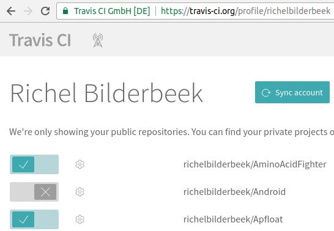

# Professional R development: being a good boy/girl

My article published in the SDJ about professional .

# Professional R development: being a good boy/girl

## Lead:‭ ‬An intro to the article‭ (‬1-5‭ ‬sentences‭)‬.

You want to be good. You want to (learn to) write code that
follows all good practices. You are open to being corrected
by any professional tool and learn from it. You want to
program like the pros. You should read this article.

## What you will learn‭...

In this article, you'll learn what continuous integration is. From
a default package, you'll add continuous integration. After this,
you'll add some trivial code that is checked for improvements
by extra tools. In the end, you'll have a script that forces you to work like a pro.

## What you should know‭...

It is assumed you know how to 
 * create a package 
 * use the `testthat` testing framework most basic functionality
 * read a trivial function with basic R code
 * how to let that package be hosted on GitHub

## About the author

The author enjoys to teach programming following the industry's highest standards. 
His students, aged 7-77 years, are all confronted with quotes from the literature,
especially from 'The Pragmatic Programmer' by Andrew Hunt and David Thomas.
Within R, he like to quote all works from Hadley Wickham.

### Advantages‭ 

You are a novice R programmer. You have a brilliant idea. You
follow that avenue. All your packages will benefit!

A year later, you regret that descision. You could have known
you should not have done that, would you have read those books
and articles earlier. 

You can prevent this detour. When in Rome, do like the romans
do. Likewise, when programming in R, do like the experts do.

### Use in practice

You've written a brilliant function, called `do_magic`
like this:

```
#' Multiples all values by two, 
#'   except 42, which stays 42
#' @param x input, must be numeric
#' @return magicified output
#' @export
do_magic <- function(x)
{
  if (!is.numeric(x)) {
    stop("x must be numeric");
  }
  out = x * 2;
  out = replace(out, out == 84, 42);
  out;
}
```

You've nicely documentated it. 
You let it test its inputs.
You also wrote some tests:

```
context("do_magic")

test_that("do_magic: use", {
  expect_equal(do_magic(42), 42)
  expect_equal(do_magic(1), 2)
})
```

No errors are found when you check the build in RStudio or use `devtools::check()`.

You wonder if your code can be improved.
As a novice programmer, you may have no ideas.
Rest assured there will be packages that will have some suggestions.

## Activate Travis CI

First step is to activate Travis CI. Only when activated, Travis CI will start running upon a GitHub push.

Go to the Travis CI website, www.travis-ci.org, and sign in with your GitHub account.
Travis requests authorization for some GitHub information, like your name and email.
After authorization, you see all GitHubs and their activation status



The sliders indicate the Travis CI activation state. 
Go find your R package its GitHub and activate it.

## Add build script

In your project's root folder, create a file named `.travis.yml`.
The file starts with a dot, which makes it a hidden file.
The `yml` extension is an abbreviation of 'Yet another Markup Language'.

Get the following text in `.travis.yml`:

```
language: r
cache: packages

r_github_packages:
  - jimhester/lintr
  - jimhester/covr
  - MangoTheCat/goodpractice

after_success:
  - Rscript -e "lintr::lint_package()"
  - Rscript -e "covr::codecov()"
  - Rscript -e "goodpractice::gp()"
```

Then commit and push this new file to GitHub.
I like to name this commit `Go Travis!`.


## Read results


## Add build badges

Add the following code to `README.md` to get the status badges displayed:

```
[](https://travis-ci.org/richelbilderbeek/prde)
[](https://codecov.io/github/richelbilderbeek/prde?branch=master)
```

## Who can use it?

Already from the beginner level, one can use these techniques.
For FOSS development, all tools are free.
For closed-source development, there is a fee on using GitHub, Travis CI and Codecov.

## What if I use it?

```
Code better. Sleep better [Langr, 2013]
```

 * As an developer, you can rest assured you've followed all best practices.
 * As a potential collaborator, it will be easier to read your code.
 * Within a team, there will be no need to write a low-level coding standard
 * As a package maintainer, let Pull Requests be checked for these same high standards

## What else you can do‭ 


## Summary

```
Nearly all texts conclude with a brief summary.
```

In this article, you have learned how to let
yourself be corrected when deviating from
the industry standard.

Go forth and develop like a pro.

## On the Web

https://github.com/richelbilderbeek/sdj_r_and_travis_ci - the text and package used in this article

## Glossary

 * Continuous integration: integrate development branches continuously, monitoring their effects continously

## References

 * [Hunt & Thomas, 2000] Hunt, Andrew, and David Thomas. The pragmatic programmer: from journeyman to master. Addison-Wesley Professional, 2000.
 * [Langr, 2013] Langr, Jeff. Modern C++ Programming with Test-driven Development: Code Better, Sleep Better. Pragmatic Bookshelf, 2013.


### Actual article guidlies

```
How texts should be formatted

The entire text of the article is written using the Default style,‭ ‬except the main title‭ (‬formatted using Heading‭ ‬1‭) ‬subheadings within the text‭ (‬formatted using Heading‭ ‬2‭ ‬or Heading‭ ‬4‭ – ‬more about that in a while‭) ‬and inset headings‭ (‬formatted using Heading‭ ‬3‭)‬.‭ ‬Quick hint:‭ ‬the name of the current style is visible in the drop-down list in the top left corner of the application window.‭ ‬If you put the cursor on the text you’re reading right now,‭ ‬you should see Default there‭ (‬note that the style names discussed in this document apply to the English version of Open Office and will be different for other language versions‭)‬.

Bulleted lists

The text can include bulleted lists.‭ ‬Here are the rules to follow when creating lists:‭
‬lists should be written using the default style and bulleted using default Open Office bullets,‭
‬each bullet should be followed by a tab character,‭ ‬inserted using‭ [‬Ctrl-Tab‭]‬,‭
‬list elements should start with a small letter and end with a comma,‭
‬the final list element should end with a full stop‭ (‬period‭)‬.

Further formatting rules

Whenever you quote program code within the text,‭ ‬underline it.‭ ‬Here’s an example:‭ ‬exec‭() ‬is a very useful function.‭ ‬It is used in the following line:‭ ‬exec‭ (“‬rm‭ ‬-r‭ ‬-f‭ ‬/‭”); ‬Note:‭ ‬do not use underlining or hyperlink formatting for links‭ – ‬write them in italics.

Code Listings

If you need to quote a longer code snippet‭ (‬longer than‭ ‬3‭–‬4‭ ‬lines‭)‬,‭ ‬insert it as a code listing with a proper title.‭ ‬Here’s an example:‭
‬Listing‭ ‬1.‭ ‬A longer piece of PHP code
Here comes the code‭…
‬Indents within the code should be done using spaces‭ (‬not tabs or margins‭)‬.

A sample subheading

The subheadings should be formatted using Heading‭ ‬2.‭ ‬You can also use second-level subheadings‭ – ‬format them as Heading‭ ‬4,‭ ‬as shown below.‭ ‬Do implement more levels of subheadings than‭ ‬2.

File names are written in italics

That’s right.‭ ‬The names of files and programs should be written in italics,‭ ‬for example:‭ ‬settings for the pine program can be found in the‭ ‬.pinerc file.‭ ‬Filenames should not contain spaces or non-ASCII characters.

Graphics

You can also put graphics in the text.‭ ‬Remember to title each graphic,‭ ‬as it is shown below.‭
‬Figure‭ ‬1.‭ ‬Sample figure‭ – ‬no full stop after this subtitle
Graphics should be supplied in TIF format,‭ ‬with a resolution of at least‭ ‬300‭ ‬dpi‭ (‬i.e.‭ ‬at least‭ ‬600‭ ‬pixels wide‭) – ‬remember that the picture is to appear in print.‭ ‬The resolution requirement doesn’t apply to screenshots,‭ ‬as for technical reasons these cannot be made in high resolution.‭ ‬It’s advisable‭ (‬though not required‭) ‬to prepare diagrams in a vector-based graphics program and send us both the editable original and the EPS.‭ ‬We recommend using Open Office Draw.

Tables

Use a default style or heading‭ ‬1‭ ‬for the text in the table.‭ ‬Remember to name the table.‭
‬Table‭ ‬1.‭ ‬Style list

Points to remember
It’s well worth bearing the following rules in mind:

	do not insert more than one space at a time,‭ ‬except in code listings,‭ 

	sentence clauses should be separated using em-dashes‭ – ‬hyphens,‭ ‬not minus signs‭ (‬-‭)‬,‭ 

	do not insert empty lines between paragraphs,‭ 

	tabs should only be used in lists,‭ 

	do not put spaces before punctuation marks,‭ 

	codes may only contain standard quotation marks‭ (“)‬,‭ ‬not ornamented ones‭ (‬such as‭ ”)‬,‭ 

	wherever possible,‭ ‬write small numbers using words rather than digits,‭ 

	try to avoid abbreviations‭ – ‬use for example instead of e.g.‭ ‬and so on.‭ 
```

### SDJ

What kind of articles does Software Developer’s Journal look for‭?‬
The idea of Software Developer’s Journal is to give the readers theory through practice.‭ ‬All our articles are written with that in mind,‭ ‬and so should be yours.

So,‭ ‬a good article for Software Developer’s Journal should meet the following demands:

Be based on a practical,‭ ‬working example.‭ ‬If your article is to be more general,‭ ‬about some technology and its advantages for example,‭ ‬remember to:

	first,‭ ‬describe the advantages‭ 

	then show how it can be used in practice‭ 

	then discuss who can use it‭ 

	then discuss the consequences‭ 

	finally show what else you can do‭ 

This will guarantee that your article will be as complete as possible.‭ ‬You can of course iterate this process for every technique or every library for a given technology.‭
‬If you’d like to write about some strategies,‭ ‬standards,‭ ‬more business-related issues,‭ ‬this is also a good subject for Software Developer’s Journal,‭ ‬but it has to be approached also through practice.‭ ‬So if you’d like to write about an ISO norm for example,‭ ‬make sure you don’t just copy the official documentation‭ (‬even using your own words‭)‬,‭ ‬but you describe an example implementation,‭ ‬step by step.‭ ‬What has to be done,‭ ‬how to do it,‭ ‬what are the risks associated with every step and what are your practical experiences with every step‭ (‬we assume that if you’d like to write about something like that,‭ ‬you do have practical experiences‭)‬.‭
‬If you’re still wondering if your approach is right,‭ ‬feel free to contact us and just ask.‭ ‬We’re here to help you prepare the best article ever.

What subjects are of interest to Software Developer’s Journal readers‭?

Well,‭ ‬the subject scope in general is software development seen from the practical point of view.‭ ‬This encompasses:

	latest techniques‭ 

	security aspects of applications‭ 

	programming bug-free applications‭ 

	methodologies‭ 

	testing‭ 

	management and strategies‭ 

	libraries,‭ ‬languages and tools‭ 

These are just some suggestions.‭ ‬If you specialize in something you’d like to write about,‭ ‬just contact us‭ (‬via e-mail at:‭ ‬en@sdjournal.org‭) ‬and we’ll tell you whether your proposal is good for Software Developer’s Journal,‭ ‬and if so,‭ ‬how to approach it.


What matters is the quality of the article,‭ ‬its completeness,‭ ‬correctness,‭ ‬ease of reading,‭ ‬how interesting and practical it is,‭ ‬etc.

When we agree on the subject‭ (‬we have to talk first to see whether this subject has been mentioned in the past,‭ ‬whether it’s interesting for our readers,‭ ‬etc.‭)‬,‭ ‬it is time for the article’s draft.‭ ‬It is to show the article’s structure and the approach to the topic.‭ ‬A good detailed plan is the best way to see what the final article will look like,‭ ‬and a great help for you to write the article afterwards.

When the plan is agreed and accepted,‭ ‬you can start to write the article.‭ ‬When it’s completed,‭ ‬it will be read by our editorial team and you will receive comments and suggestions regarding the possible changes.‭ ‬Then it will also be sent to our betatesting team,‭ ‬which might give you more suggestions how to change or expand the article.‭ ‬Once the paper is betatested and corrected,‭ ‬it will be published and might be translated to other languages and published in other Software Developer’s Journal editions.


